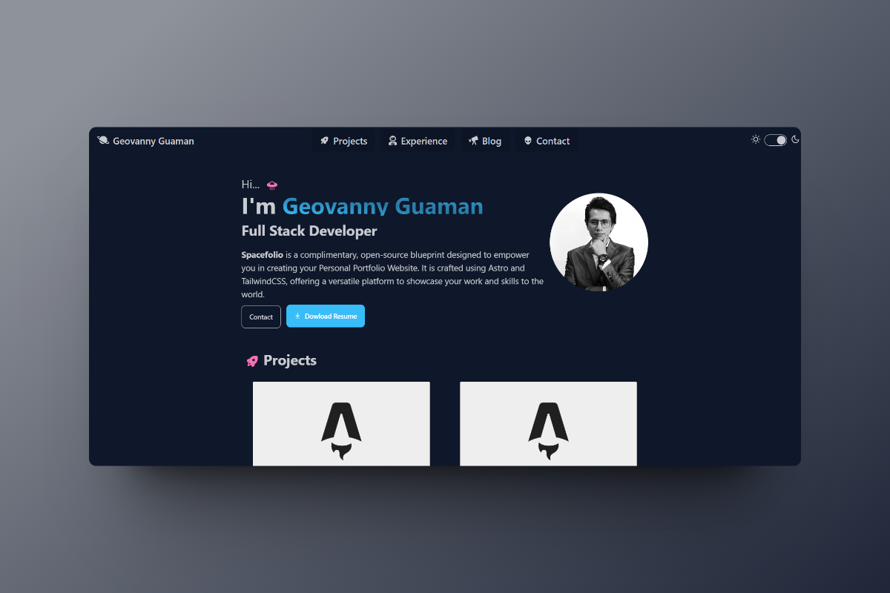

# Space Portfolio | Personal Portfolio Template



Spacefolio is a complimentary, open-source blueprint designed to empower you in creating your Personal Portfolio Website. It is crafted using Astro and TailwindCSS, offering a versatile platform to showcase your work and skills to the world.

## Stack

- [Astro](https://astro.build)
- [tailwindcss](https://tailwindcss.com/)
- [DaisyUI](https://daisyui.com/)

## Demo

View a live demo of [Spacefolio](https://spacefolio-iota.vercel.app/)

## Installation

To get started, you need to clone the repository and install the dependencies.

```bash
pnpm install
```

## Development
To start the development server, run the following command:

```bash
pnpm run dev
```

## Project Structure

```php
src
├── components
│   ├── BaseHead.astro
│   ├── Card.astro
│   ├── Footer.astro
│   ├── HorizontalCard.astro
│   ├── NavBar.astro
│   ├── ThemeController.astro
│   └── TimeLine.astro
├── config.ts
├── content
│   ├── blog
│   │   ├── post1.md
│   │   ├── post2.md
│   ├── config.ts
│   └── projects
│       ├── project1.md
│       ├── project2.md
├── icons
│   ├── alien.svg
│   ├── arrow-right.svg
│   ├── astronaut.svg
├── layouts
│   ├── BaseLayout.astro
│   ├── PostLayout.astro
│   └── ProjectLayout.astro
├── lib
│   └── createSlug.ts
─ pages
    ├── 404.astro
    ├── blog
    │   ├── [...page].astro
    │   ├── [slug].astro
    │   └── tag
    │       └── [tag]
    │           └── [...page].astro
    ├── contact.astro
    ├── experience.astro
    ├── index.astro
    └── projects
        ├── [...page].astro
        └── [slug].astro
```
### Site config

You can change global site configuration on '/src/config.ts' file:

- **SITE_TITLE**: Default pages title.
- **SITE_DESCRIPTION**: Default pages description.
- **GENERATE_SLUG_FROM_TITLE**: By default Spacefolio will generate the blog and projects slug pages base on the entry name. Set this var to false if you want to use the Astro file base.
- **TRANSITION_API**: Enable and disable transition API
- **NAME**: Your name, used in the header and footer.
- **RESUME_LINK**: Your resume file link.
- **MENU_ITEMS**: Array of objects with the menu items base on pages created, each object should have a `title`, `tooltip`, `url` and `icon` properties. The `tooltip` indicates the direction of the tooltip when the text is hidden, however, in mobile view, the tooltip will show always in the bottom.
- **TECH_STACK**: Array of objects with the tech stack used in the experience section, each object should have a `name` and `icon` properties.
- **SKILLS**: Array of objects with the skills used in the experience section, each object should have a `icon`, `reverseIcon` and `name` properties.
- **SOCIAL_LINKS**: Array of objects with the social links used in the sidebar, each object should have a `title`, `url` and `icon` properties.

### Icons

You can add your own icons in the `/src/icons` folder and use them in your components, for example:

```html
<Icon name="alien" size={25} class="text-black" />
```

#### Where to find icons?
- [Iconify](https://icon-sets.iconify.design/)
- [SVGL](https://svgl.vercel.app/)
- [Simple Icons](https://simpleicons.org/)

### Need to optimize your images? Try Squoosh
- [Squoosh](https://squoosh.app/)

### Content
#### Blog

Add your `md` blog post in the `/content/blog/` folder. For projects, add your `md` project in the `/content/projects/` folder.

The content of the post follows the markdown format, and the properties of the post are defined in the frontmatter of the file.

##### Post format

Properties available for each post:

```js
---
title: "Post Title"
description: "Description"
pubDate: "Post date format(Sep 10 2022)"
heroImage: "Post Hero Image URL"
tags: ["tag1", "tag2"]
---
```

##### Project format

Properties available for each project:
```js
---
title: "Demo Item 1"
description: "Item description"
pubDate: "Sep 10 2022"
important: true // Show project at the top of the list
badge: "New" // Badge to show in the project card
heroImage: "/post_img.webp"
tags: ["tag1", "tag2"]
---
```


### Theming

To change the template theme set light theme in the `data-theme` attribute of the `<html>` tag in `BaseLayout.astro` file.

And set light and dark theme in the `ThemeController.astro` component using constants `LIGHT_THEME` and `DARK_THEME` respectively.

You can choose among 30 themes available or create your custom theme. See themes available [here](https://daisyui.com/docs/themes/).


## Deploy

You can deploy your site on your favourite static hosting service such as Vercel, Netlify, GitHub Pages, etc.

## Presentation
Craft beautiful presentations with [Shots](https://shots.so/)

## Contributing

Suggestions and pull requests are welcomed! Feel free to open a discussion or an issue for a new feature request or bug.

One of the best ways to contribute is to grab a [bug report or feature suggestion](https://github.com/Nogyboy/spacefolio/issues) that has been marked `accepted` and dig in.

Please be wary of working on issues _not_ marked as `accepted`. Just because someone has created an issue doesn't mean we'll accept a pull request for it.

## License

spacefolio is licensed under the MIT license — see the [LICENSE](https://github.com/Nogyboy/spacefolio/blob/main/LICENSE) file for details. 

## Contributors

<a href="https://github.com/Nogyboy/spacefolio/graphs/contributors">
  
</a>

Made with [contrib.rocks](https://contrib.rocks).
